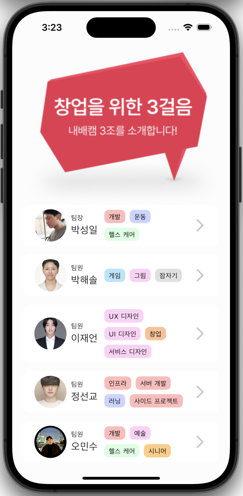
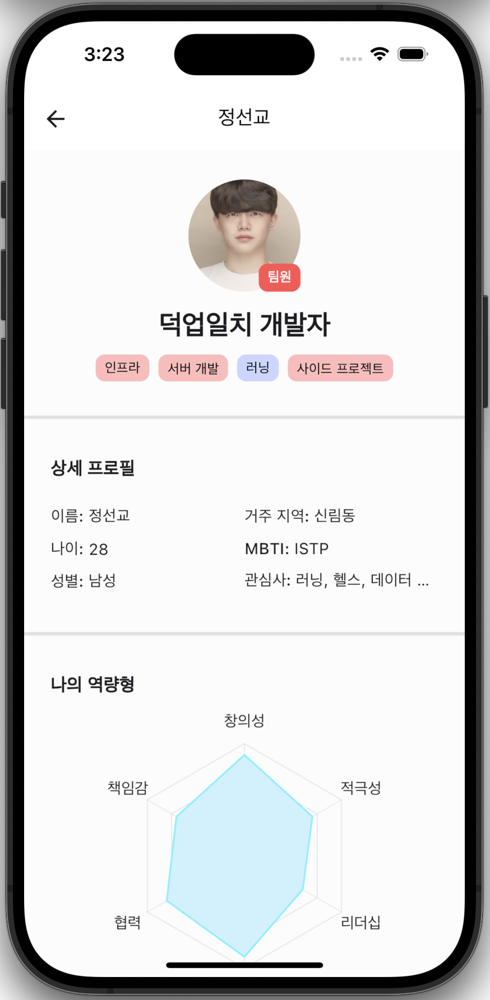
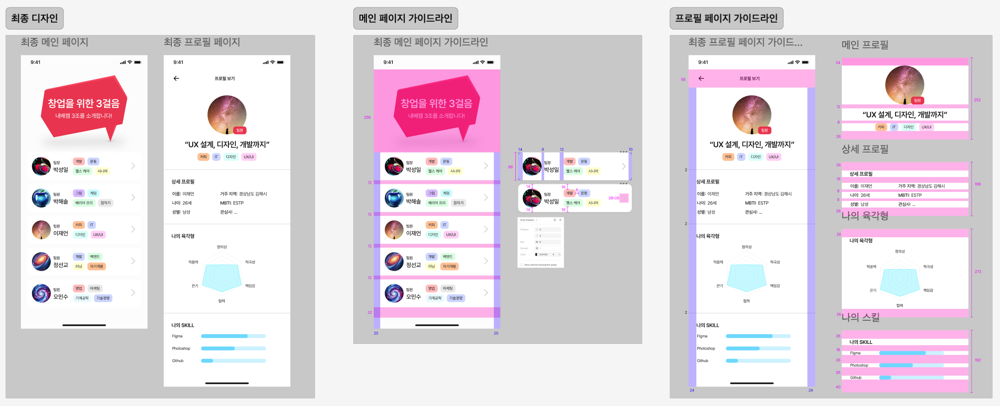
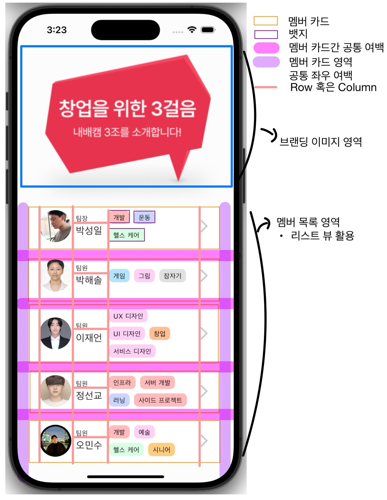
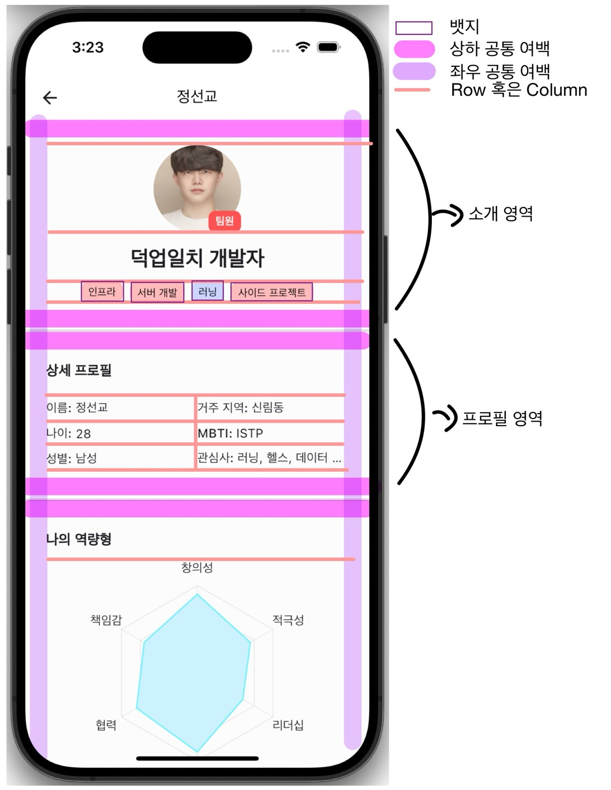
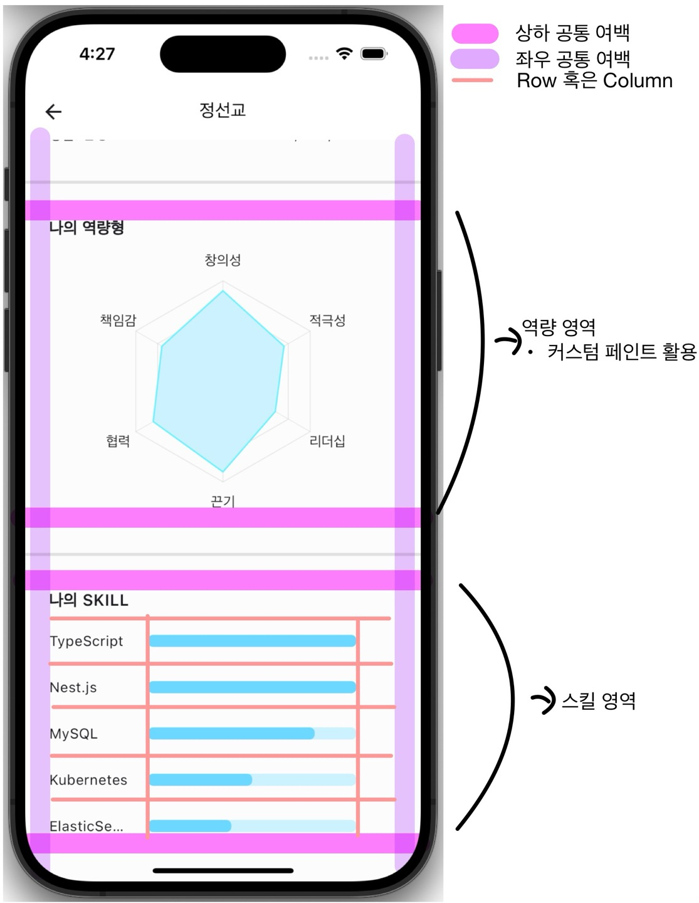

# 팀 스파르타 앱 창업 5기 - 3조 팀 소개 앱

> 발표 자료: https://drive.google.com/file/d/1J5CX1R0TadwfdP6z0UaKGpdZ8C0WnBgS/view?usp=drive_link

## 앱 소개

- 플러터 앱 창업 과정의 첫 주 동안 진행된 프로젝트로, 팀원을 소개하는 앱 입니다. 
- 각 팀원의 프로필, 역량, 그리고 스킬 숙련도를 간단하게 보여줍니다.

## 앱 실행 화면

<table>
    <tr>
        <td align="center" width="33%">
            
            <p>실행 영상</p>
        </td>
        <td align="center" width="33%">
            
            <p>홈 화면</p>
        </td>
        <td align="center" width="33%">
            
            <p>팀원 상세 화면</p>
        </td>
    </tr>
</table>


## 주요 기능

- 팀원 목록을 보여주는 홈 화면과 팀원의 프로필 정보를 보여주는 상세 페이지, 2개의 화면으로 구성됩니다.
- 팀원별 프로필, 역할, 관심사, MBTI, 역량에 대한 육각형 차트, 스킬에 대한 능력치 시각적으로 보여줍니다.

# 앱 설계 과정

## 앱 디자인 및 가이드라인 작성

<div style="text-align: center;">
    
    <p>최종 디자인 및 가이드 라인</p>
</div>

## 주요 UI 구성 요소 정의 및 레이아웃 설계

<table width="100%">
    <tr>
        <td align="center" width="33%">
            
            <p>홈 UI 설계</p>
        </td>
        <td align="center" width="33%">
            
            <p>팀원 상세 화면 1</p>
        </td>
        <td align="center" width="33%">
            
            <p>팀원 상세 화면 2</p>
        </td>
    </tr>
</table>


- 2개의 페이지와 12개의 컴포넌트로 정의
- 페이지와 컴포넌트는 각각의 파일로 정의
    - 코드의 복잡도를 낮추고 재사용성을 높이기 위함
- 페이지
    - 홈
    - 상세
- 컴포넌트
  - 공통
    - 뱃지
    - 육각형 차트
    - HorizontalDivider
    - 브랜딩 이미지
  - 유저(팀원)
    - 카드
    - 카드 목록
  - 유저(팀원) 상세
    - 소개 영역
    - 프로필 영역
    - 프로필 (e.g. 성별: 남성)
    - 역량 영역
    - 스킬 영역
    - 스킬

## 폴더 구조
```bash
root
├── assets                   # 애셋 파일 (폰트, 이미지 등)
│   ├── fonts                # 폰트 파일
│   └── images               # 이미지 파일
│       ├── members          # 팀원 관련 이미지
│       ├── screenshots      # 스크린샷 이미지
│       └── sparta.png       # 스파르타 이미지
├── lib                      # 주요 소스 코드
│   ├── components           # 재사용 가능한 컴포넌트
│   │   ├── common           # 공통 컴포넌트
│   │   ├── user             # 팀원 관련 컴포넌트
│   │   └── user_detail      # 팀원 상세 정보 컴포넌트
│   ├── models               # 데이터 모델
│   │   └── UserProfile.dart # 팀원 프로필 데이터 모델
│   ├── pages                # 앱의 주요 화면
│   │   ├── HomeScreen.dart  # 홈 화면
│   │   └── UserDetailScreen.dart # 사용자 상세 화면
│   └── utils                # 유틸리티 파일
│       ├── CaculateAge.dart # 나이 계산 유틸리티
│       ├── contant.dart     # 상수 정의 파일
│       └── main.dart        # 앱의 진입점
├── README.md                # 프로젝트 설명 파일
├── pubspec.yaml             # Flutter 프로젝트 설정 파일
└── ...
```

## 데이터 관리

- 페이지별로 레이아웃을 재사용하기 위해 모든 데이터는 별도의 상수에 json형태로 관리
- 메인페이지(홈)에서 각 컴포넌트/페이지에 필요한 데이터를 주입하여 사용

```elixir
e.g.

[
  {
    'name': '정선교',
    'description': "덕업일치 개발자",
    'role': '팀원',
    'badges': ['인프라', '서버 개발', '러닝', '사이드 프로젝트'],
    'profileImage': 'members/seonkyo.jpg',
    'birth': '1996.04.05',
    'gender': '남성',
    'mbti': 'ISTP',
    'position': '백엔드 개발자',
    'location': '서울 어딘가',
    'interests': '러닝, 헬스, 데이터 분석',
    'skills': {
      'TypeScript': 1.0,
      'Nest.js': 1.0,
      'MySQL': 0.8,
      'Kubernetes': 0.5,
      'ElasticSearch': 0.4,
    },
    'capabilities': {
      '창의성': 0.9,
      '적극성': 0.7,
      '리더십': 0.6,
      '끈기': 0.9,
      '협력': 0.8,
      '책임감': 0.7,
    }
  },
  ...(멤버별 위와 동일한 구조)
]
